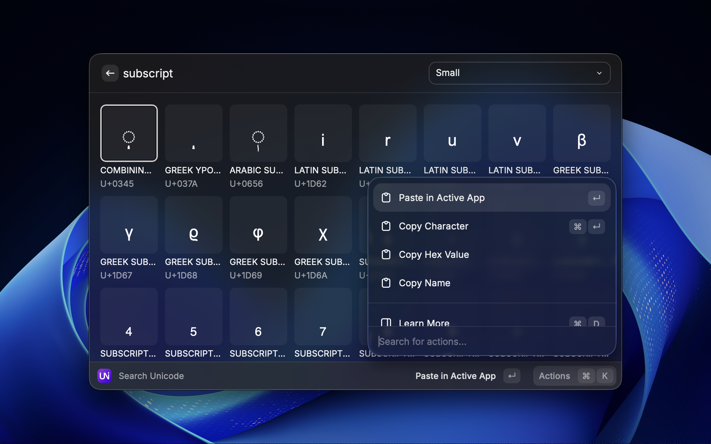
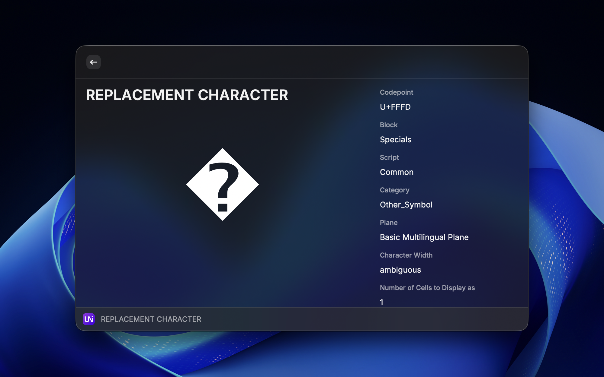
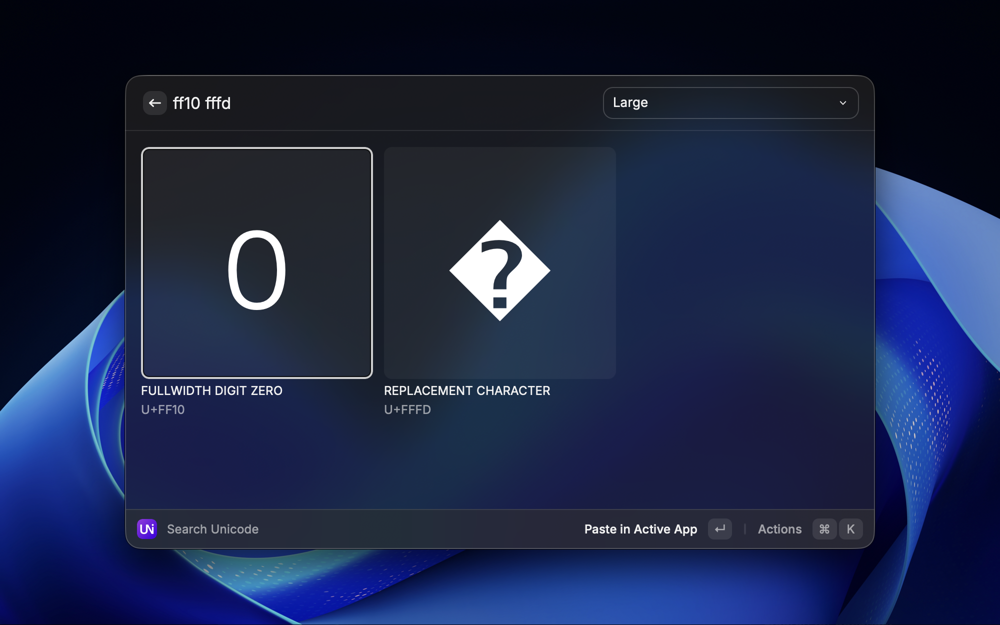
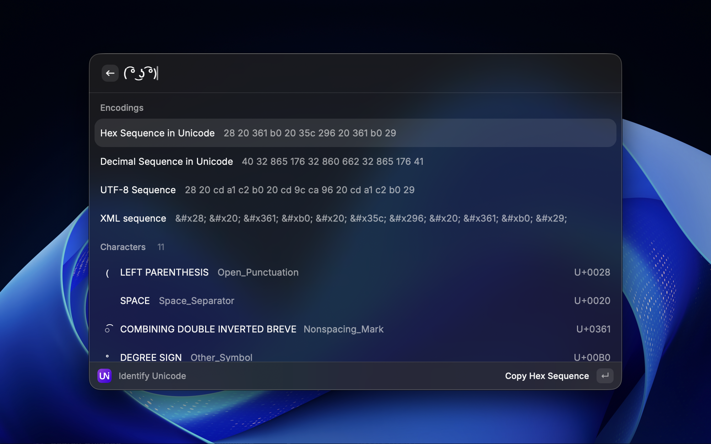
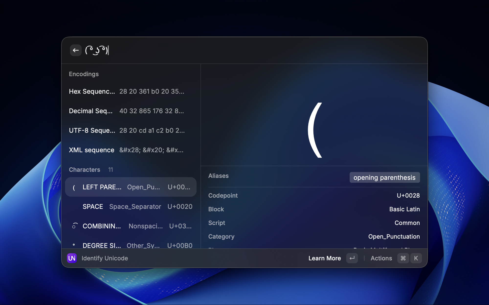

# Search Unicode

Search Unicode is a set of Raycast plugins to lookup and reverse lookup Unicode characters and emoji with their names. This is a port of [Search Unicode for Alfred] workflows and [Search Unicode for Flow Launcher] plugin.

[Search Unicode for Alfred]: https://github.com/blueset/alfred-search-unicode/
[Search Unicode for Flow Launcher]: https://github.com/blueset/flow-search-unicode/

## Install

(To be published)

## Usage

### Search character by description



In “Search Unicode”, type your query (ex. `subscript`) to get a list of characters
matching the keyword.

Press <kbd>Enter</kbd> to paste the character to your active input (ex. `₀`), press <kbd>Ctrl</kbd> + <kbd>Enter</kbd> (or <kbd>Cmd</kbd> + <kbd>Enter</kbd>) to copy the character. Press <kbd>Ctrl</kbd> + <kbd>D</kbd> to see more information about the character.



### Search character by code point



Type a sequence of hexadecimal codepoints (ex. `ff10 fffd`) to look up characters by their codepoints.

### Identify characters in a string



In “Identify Unicode”, type any string (ex. `( ͡° ͜ʖ ͡°)`) to identify characters in a string.

Press <kbd>Enter</kbd> to show details about the character, or press <kbd>Ctrl</kbd> + <kbd>Enter</kbd> (or <kbd>Cmd</kbd> + <kbd>Enter</kbd>) to have details shown in a side bar.



### Footnotes

Search emoji is omitted in this plugin as Raycast has built-in emoji search.

## Options

### Plugin-wide options

#### Choose executables

You can choose to use one of the following options to run the `uni` executable:

- **WebAssembly (WASM)** (default on macOS): This option uses a WebAssembly version of `uni` bundled with the plugin. This option does not require any installation, but may be slower than the native version.
- **Bundled Native** (default on Windows): This option uses a native version of `uni` bundled with the plugin. This option does not require any installation, and is faster than the WASM version. However, it might not work on macOS due to developer certificate issues.
- **System Installed**: This option uses a system-installed version of `uni`. You need to install `uni` manually using a package manager like Homebrew (macOS) or Scoop/Chocolatey (Windows).
- **Custom Path**: This option allows you to specify a custom path to the `uni` executable.

### “Identify Unicode” options

- **Show Encodings**: When enabled, character encodings (UTF-8, Hex codepoints, etc.) will be shown in the results.

## Credit

This workflow depends on resources from:

- [arp242/uni] 2.8.0 with Unicode 15.1, forked to [blueset/uni] for WebAssembly performance improvements.

[arp242/uni]: https://github.com/arp242/uni
[blueset/uni]: https://github.com/blueset/uni/tree/fork

## License

```plain
Copyright 2024 Eana Hufwe <https://1a23.com>

Permission is hereby granted, free of charge, to any person
obtaining a copy of this software and associated documentation
files (the “Software”), to deal in the Software without
restriction, including without limitation the rights to use,
copy, modify, merge, publish, distribute, sublicense, and/or sell
copies of the Software, and to permit persons to whom the
Software is furnished to do so, subject to the following
conditions:

The above copyright notice and this permission notice shall be
included in all copies or substantial portions of the Software.

THE SOFTWARE IS PROVIDED “AS IS”, WITHOUT WARRANTY OF ANY KIND,
EXPRESS OR IMPLIED, INCLUDING BUT NOT LIMITED TO THE WARRANTIES
OF MERCHANTABILITY, FITNESS FOR A PARTICULAR PURPOSE AND
NONINFRINGEMENT. IN NO EVENT SHALL THE AUTHORS OR COPYRIGHT
HOLDERS BE LIABLE FOR ANY CLAIM, DAMAGES OR OTHER LIABILITY,
WHETHER IN AN ACTION OF CONTRACT, TORT OR OTHERWISE, ARISING
FROM, OUT OF OR IN CONNECTION WITH THE SOFTWARE OR THE USE OR
OTHER DEALINGS IN THE SOFTWARE.
```
